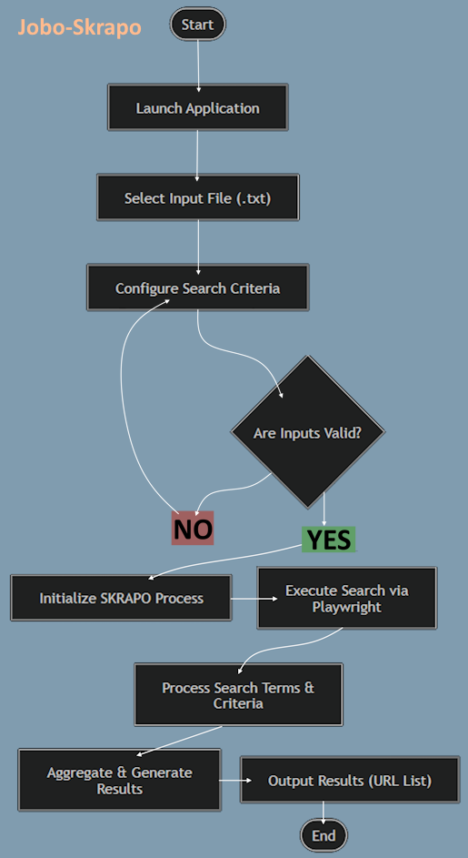

# Jobo-Skrapo

## What is it?
Jobo-Skrapo is a job search automation and scoring tool built to cut through the noise of
modern job listings. Users define weighted filter criteria, run multiple targeted searches
against Indeed, and receive scored, ranked HTML reports = no manual sifting required.

The goal is precision over volume. Jobo-Skrapo doesn't just find listings that match keywords.
It scores them against your criteria, flags what matters, penalizes what doesn't, and surfaces
the best results across multiple searches in a single compiled report.

---

## Application Flow



Note: The flowchart above represents the initial high-level design. Full process detail
is documented in `planning/Design_Requirements.md`.

```
(START)
  - Launch application (GUI)
  - Load criteria file (default_criteria.txt or custom .txt / YAML / JSON)
  - Configure search queries and output settings via UI
  - Validate inputs

  For each search query:
    - Execute Playwright-driven search against Indeed
    - Parse and extract listing content
    - Score each listing against weighted criteria
    - Generate ranked HTML report (top N results)

  Report Compiler:
    - Ingest all per-query HTML reports
    - Deduplicate, re-score, re-sort
    - Output master ranked HTML report

(END)
```

---

## How It Works
1. Launch the application.
2. Load a criteria file — use the included `default_criteria.txt` or supply your own.
3. Configure one or more search queries (e.g. "SDET", "QA Automation Engineer", "QA Lead",
   "Marketing Manager", "Marketing VP").
4. Set your result cap and any additional search parameters via the GUI.
5. Press **"Start SKRAPOing."**
6. Jobo-Skrapo runs each search, scores every listing against your criteria, and generates
   a ranked HTML report per query.
7. The Report Compiler combines all reports into a single master output — deduplicated,
   re-scored, and sorted by relevance.
8. Open the HTML report in any browser. Click listings directly, review scores, and see
   at a glance which criteria each listing satisfied.

---

## Scoring System
Each listing is scored based on criteria defined in your input file:

- Required terms — high positive weight per match (default: +5 per occurrence)
- Semi-helpful terms — lower positive weight per match (default: +1 per occurrence)
- Concerning terms — negative weight per match, applied per occurrence. Examples:
  - State initials to penalize on-site listings for remote-only seekers
  - Hybrid language surfacing inside listings posted as remote
  - No salary mention, or salary below a defined threshold

Listings are ranked by total score. The HTML report displays score, matched criteria
indicators, company name, and a direct link for each result.

---

## Features
- Weighted scoring engine — required, semi-helpful, and concerning term categories
- Regex-flexible criteria — supports pattern matching and term lists (e.g. all US state initials)
- Multiple search queries per session — run several job titles in one go, get a report per query
- Report Compiler — combines, deduplicates, and re-ranks results across all queries
- HTML output — opens in any browser, clickable links, visual pass/fail indicators
- GUI — no command line required; designed for non-technical users
- Default criteria file included — works out of the box for first-time users
- Custom criteria via .txt (YAML/JSON in v2.x)
- Playwright-powered browser automation — no API key required
- User-defined result cap (10–1000 listings per report)

---

## Input File
Jobo-Skrapo ships with `default_criteria.txt` as a ready-to-use starting point.
Users can load a custom criteria file via the GUI. The default file is protected —
if it is missing or replaced, the application will regenerate it automatically,
ensuring it is always available as a baseline.

The file defines three sections:
- Required — terms that strongly indicate a relevant listing
- Semi-helpful — terms that add signal but are not decisive
- Concerning — terms that reduce relevance score (unwanted locations, contract-only, etc.)

See `planning/Design_Requirements.md` for full input file specification.

---

## Requirements
- Python 3.x
- See `requirements.txt` for dependencies
- After installing dependencies, run: `playwright install`

---

## Roadmap
| Version | Scope |
|---------|-------|
| v1.0 | Indeed support, scoring engine, HTML report, GUI, Report Compiler |
| v2.0 | Expanded site support (LinkedIn, Glassdoor, etc.) |
| v2.x | YAML/JSON criteria input, additional scoring customization |

---

## Notes
This tool is intended for personal, non-commercial use. Please review Indeed's terms of service
before use. Jobo-Skrapo interacts with public search results only.
Source available at: https://github.com/GutieM
